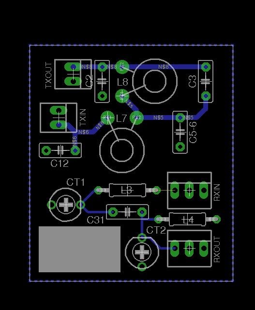

# SODA POP band module
This repository contains Eagle files for band modules for the
[SODA POP][sodapop] by [Steve Weber KD1JV][kd1jv]. The SODA POP was originally
designed as a single band QRP CW transceiver on a 3.6" square board. The mods
described below make it a multi-bander.

## Main board
- L3 has to be shorted.
- Add 2-pin female headers on the place of L7 and L8
- Add 3-pin female headers on the place of CT1 and CT2 (middle pin should be
  removed)

## Software
- The software has to be adapted as described in the manual under "Manual band
  selection".

## Modules
The following components are moved to the band module:

- **TX**: C2, C3, C5 (and C6), C12, L7, L8
- **RX**: L3, CT1, C31, CT2, L4

Their values can be taken from the manual under "Band specific parts". One
part, C31, is on the band module even though it has a fixed value (5p).

## Notes

- The board layout assumes a T30-2 toroid. For 60m and up, a T37-2 or even
  T50-2 is used. I have attempted to leave as much space around the toroids as
  possible, so that this will hopefully fit. However, I did not try that (yet),
  and L8 may extend beyond the PCB boundaries.
- I used through-hole components because they are easier to source for most
  people.
- There should be enough margin on the borders to solder a PCB casing around.

## Author &amp; License
These files were made by [Camil Staps][cs], PD7LOL. They are hereby placed in
the public domain.

[cs]: https://camilstaps.nl
[kd1jv]: http://kd1jv.qrpradio.com/
[sodapop]: https://groups.yahoo.com/neo/groups/AT_Sprint/files/SODA%20POP/
