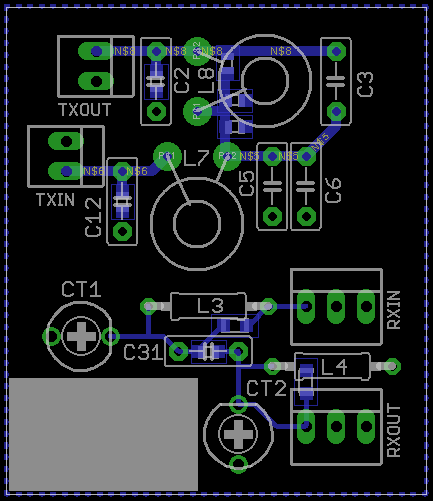
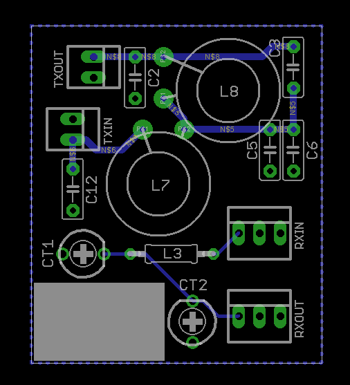
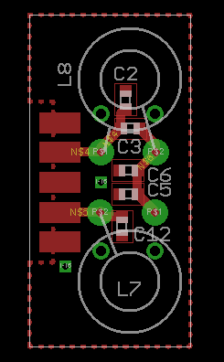
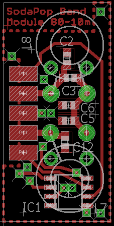

# SODA POP band module
This repository contains Eagle files for band modules for the
[SODA POP][sodapop] by [Steve Weber KD1JV][kd1jv]. The SODA POP was originally
designed as a single band QRP CW transceiver on a 3.6" square board. The mods
described below make it a multi-bander.

**Warning**: I have not actually tried to use these files yet. They may have
errors. I shall in no event be liable for any claim, damages or other
liability, whether in action of contract, tort or otherwise, arising from, out
of or in connection with these files or their use.

Two versions are available: one with headers and either through-hole or SMT
components; one with SMT components and a DB9 connector. The DB9 one has an
option for automatic band selection. Some modifications have to be made to the
main board for both modules.

The most recent version of these modules can be ordered from OSH Park from
https://oshpark.com/profiles/PD7LOL.

---

- [Common mods](#common-mods)
- [Through-hole / SMT module with headers](#through-hole--smt-module-with-headers)
- [SMT module with DB9 connector](#smt-module-with-db9-connector)
- [SMT module with DB9 connector and auto band selection](#smt-module-with-db9-connector-and-auto-band-selection)
- [Horizontal format SMT module with DB9 connector and auto band selection](#horizontal-format-smt-module-with-db9-connector-and-auto-band-selection)
- [Author &amp; license](#author--license)

---

## Common mods

### Main board
- The following components are moved to the band module:
	- **TX**: C2, C3, C5 (and C6), C12, L7, L8
	- **RX**: L3, CT1, C31, CT2, L4

	Their values can be taken from the manual under "Band specific parts". One
	part, C31, is on the band module even though it has a fixed value (5p).

### Software
- The software has to be adapted as described in the manual under "Manual band
  selection".

## Through-hole / SMT module With headers
- L3 has to be shorted (on the main board).
- Add 2-pin female headers on the place of L7 and L8
- Add 3-pin female headers on the place of CT1 and CT2 (middle pin should be
  removed)

If you want to make a 160m module with through-hole components, the layout is
slightly different to make room for the T50-2 toroids. Also, C31 is removed in
this case, and L4 is omitted (as in the manual). If building with SMT
components, you can use the same layout as for the other modules, short C31 and
leave out L4.

For 80m, there is no separate layout. Simply leave L4 empty and short C31.

For 60m and 80m, the T37-2 should fit on the normal board.

When plugged in, these band modules cover the ON/OFF switch on the main board.
I would suggest either mounting the switch on the case or omitting it (and turn
the rig on and off by applying and disconnecting a battery or power jack).

## SMT module with DB9 connector
- Add a (male) connector to the main board using short coax cables. The parts
  you should connect are L3, CT2, L7 and L8.

These files show T37-2 toroids, so they should work for all bands except 160m.
The T50-2 toroids for 160m will not fit any more, so they will extend beyond
the board boundaries.

The PCB is placed between the two rows of the DB9 connector.

## SMT module with DB9 connector and auto band selection
This is a very nice mod to the above module, contributed by
[David, VK3IL][vk3il]. It adds a [PCA9536][pca9536] that can be connected to
the I2C pins of the SODA POP controller to add automatic band selection. For
this, the firmware needs to be updated.

## Horizontal format SMT module with DB9 connector and auto band selection
This version is designed to mount parallel and above the main board using a
female DB9 connector on the module. It includes the auto-band selection feature
and is sized to support T30 to T50 size toroids so can be used for 160-10m
bands.

## Author &amp; License
These files were made by [Camil Staps][cs], PD7LOL and [David Giddy][vk3il],
VK3IL. They are hereby placed in the public domain.

[cs]: https://camilstaps.nl
[kd1jv]: http://kd1jv.qrpradio.com/
[pca9536]: http://www.nxp.com/documents/data_sheet/PCA9536.pdf
[sodapop]: https://groups.yahoo.com/neo/groups/AT_Sprint/files/SODA%20POP/
[vk3il]: http://www.vk3il.net/
